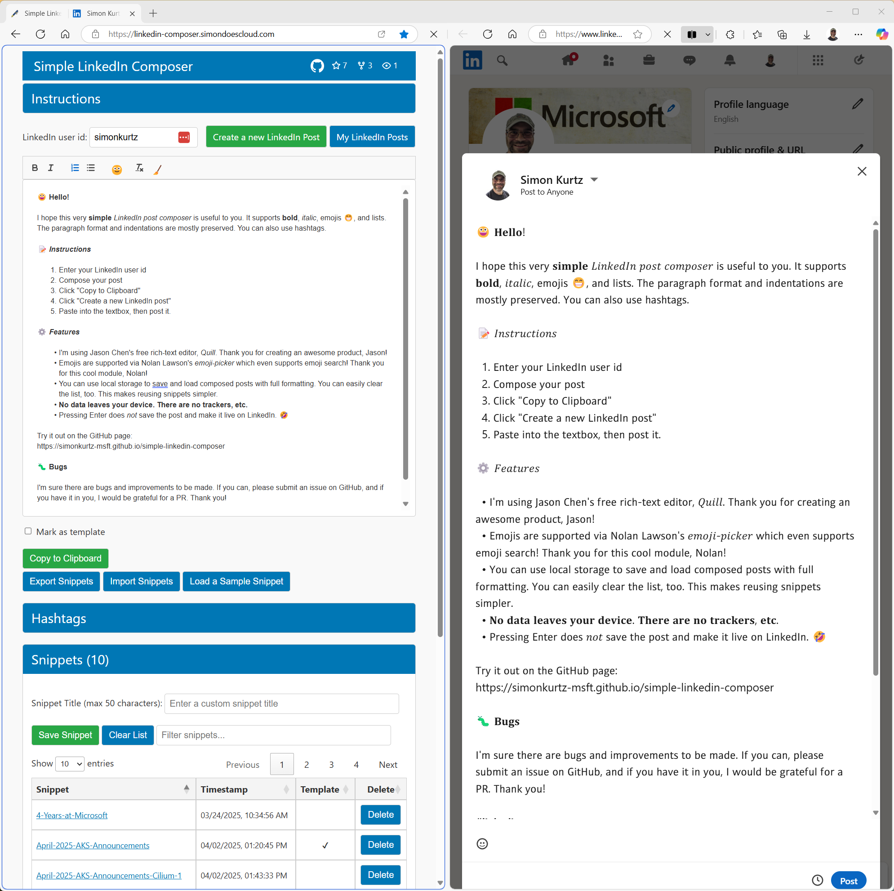

# Simple LinkedIn Composer

An enhanced rich-text editor for crafting better-formatted LinkedIn posts with emoji support and local snippet storage.

Hosted at [https://linkedin-composer.simondoescloud.com](https://linkedin-composer.simondoescloud.com)

## Table of Contents

- [✨ Features](#-features)
- [🚀 Quick Start](#-quick-start)
- [📖 Detailed Usage Guide](#-detailed-usage-guide)
- [💾 Snippet Management](#-snippet-management)
- [🏷️ Hashtags](#%EF%B8%8F-hashtags)
- [🔒 Privacy & Data](#-privacy--data)
- [🌐 Browser Support](#-browser-support)
- [🤝 Contributing](#-contributing)
- [📜 License](#-license)

## ✨ Features

- *Rich text formatting* (bold, italic, lists)
- *Emoji picker* with search functionality
- *Local storage* of post and template snippets
- *Hashtag tracking* and quick insertion
- *Export/import* snippets as JSON
- *Zero data collection* (runs 100% in browser)
- *Edge split-screen* optimized

## 🚀 Quick Start

1. Enter your LinkedIn username.
1. Compose or load a snippet. *Side-by-side is really nice in Edge!*
1. Click "Create a new LinkedIn Post".
1. Click "Copy to Clipboard." **Do not just copy content from the editor.**
1. Paste into the LinkedIn post.

## 📖 Detailed Usage Guide

### Setting Up

1. Get your LinkedIn username from your LinkedIn profile URL (e.g. [https://www.linkedin.com/in/simonkurtz/](https://www.linkedin.com/in/simonkurtz/))
1. Enter it in the "LinkedIn user id" field (saves automatically)

### Composing Posts

If you are starting with your first post, you can load a sample via the button under the editor.

Use the toolbar for formatting.

### Saving Posts

1. Click "Save snippet"
1. Add a descriptive title (max 50 chars)
1. Mark as template (optional) for frequent-use posts

### Posting on LinkedIn

1. Compose or load a snippet. *Side-by-side is really nice in Edge!*
1. Click "Create a new LinkedIn Post".
1. Click "Copy to Clipboard." **Do not just copy content from the editor.**
1. Paste into the LinkedIn post.

## 💾 Snippet Management

| Action | How To |
|--------|--------|
| Save   | Click "Save snippet" after writing |
| Load   | Click snippet name in table |
| Delete | Click "Delete" button next to snippet |
| Export | Click "Export" to download all snippets |
| Import | Click "Import" to upload snippets (handles de-duping) |

## 🏷️ Hashtags

*Simple LinkedIn Composer* automatically detects hashtags in your post and tallies them in the hashtag organizer.
The number of occurrences in your post is counted to give you insight into your own usage. You can sort by name or frequency of use (count).
Clicking ➕ inserts the hashtag at the cursor in the editor. Clicking the LinkedIn icon opens its context on LinkedIn.

## 🔒 Privacy & Data

There are **no server communications, no cloud syncs, no tracking mechanisms, no cookies, no ads, etc.**

**Everything stays in your browser's local storage.**

This tool is **entirely free to use**. Please see the very permissive [MIT license](LICENSE) for details.

Enjoy it!

## 🌐 Browser Support

| Browser       | Support Level | Notes                  |
|---------------|---------------|------------------------|
| *Chrome*      | ✅ Full       |                       |
| *Edge*        | ✅ Full       | Use split-screen      |
| *Firefox*     | ✅ Full       |                       |
| *Safari*      | ✅ Full       | MacOS/iOS 15+         |
| *Mobile*      | ⚠️ Limited    | Use Desktop Version   |

## 🤝 Contributing

Please see [CONTRIBUTING.md](CONTRIBUTING.md) for details.

We welcome:

- Bug reports
- Feature requests
- Pull requests

### Thank You

A big *THANK YOU!* to the following contributors:

- [Carolina-GomezM](https://github.com/Carolina-GomezM)

## 📜 License

MIT License - see [LICENSE](LICENSE) file for details.

---

*Try it now:* [https://linkedin-composer.simondoescloud.com](https://linkedin-composer.simondoescloud.com)

*Have questions?* Open an issue on [GitHub](https://github.com/simonkurtz-MSFT/simple-linkedin-composer/issues)
