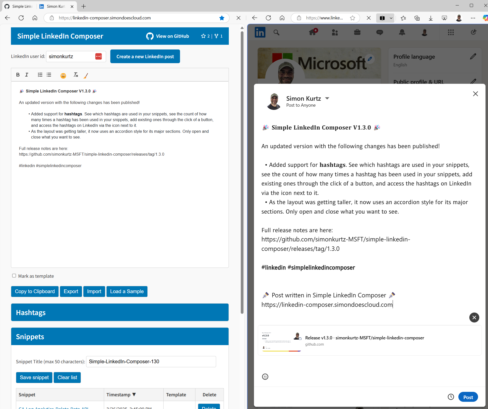

# Simple LinkedIn Composer

Hosted at [https://linkedin-composer.simondoescloud.com](https://linkedin-composer.simondoescloud.com)

An enhanced rich-text editor for crafting better-formatted LinkedIn posts with emoji support and local snippet storage.

## Table of Contents

- [✨ Features](#-features)
- [🚀 Quick Start](#-quick-start)
- [📖 Detailed Usage Guide](#-detailed-usage-guide)
- [💾 Snippet Management](#-snippet-management)
- [🏷️ Hashtags](#%EF%B8%8F-hashtags)
- [🔒 Privacy & Data](#-privacy--data)
- [🌐 Browser Support](#-browser-support)
- [🤝 Contributing](#-contributing)
- [📜 License](#-license)

## ✨ Features

- **Rich text formatting** (bold, italic, lists)
- **Emoji picker** with search functionality
- **Local storage** of post templates
- **Hashtag tracking** and quick insertion
- **Export/import** snippets as JSON
- **Zero data collection** (runs 100% in browser)
- **Edge split-screen** optimized

## 🚀 Quick Start

1. Enter your LinkedIn username.
1. Compose or load a snippet. *Side-by-side is really nice in Edge!*
1. Click "Create a new LinkedIn Post".
1. Click "Copy to Clipboard." **Do not just copy content from the editor.**
1. Paste into the LinkedIn post.

## 📖 Detailed Usage Guide

### Setting Up

1. Get your LinkedIn username from your LinkedIn profile URL (e.g. [https://www.linkedin.com/in/simonkurtz/](https://www.linkedin.com/in/simonkurtz/))
1. Enter it in the "LinkedIn user id" field (saves automatically)

### Writing Posts
- Use the toolbar for formatting:
- **B** for bold
- I for italic
- ☺ for emojis
- List buttons for bullet/numbered lists

### Saving Posts

1. Click "Save snippet"
1. Add a descriptive title (max 50 chars)
1. Mark as template (optional) for frequent-use posts

### Posting on LinkedIn

1. Compose or load a snippet. *Side-by-side is really nice in Edge!*
1. Click "Create a new LinkedIn Post".
1. Click "Copy to Clipboard." **Do not just copy content from the editor.**
1. Paste into the LinkedIn post.

## 💾 Snippet Management

| Action | How To |
|--------|--------|
| Save   | Click "Save snippet" after writing |
| Load   | Click snippet name in table |
| Delete | Click "Delete" button next to snippet |
| Export | Click "Export" to download all snippets |
| Import | Click "Import" to upload JSON backup |

<h2 id="hashtag-tools">🏷️ Hashtag Tools</h2>

The tool automatically:
- Detects all #hashtags in your posts
- Tracks how often you use each one
- Lets you:
- Sort by name or frequency
- Click ➕ to insert into current post
- Click LinkedIn icon to search the tag

<h2 id="privacy--data">🔒 Privacy & Data</h2>

- **No server communication** - everything stays in your browser
- **LocalStorage** used for:
- Saved snippets
- Hashtag history
- Your LinkedIn username
- **Export option** available for backups

<h2 id="browser-support">🌐 Browser Support</h2>

| Browser       | Support Level | Notes                  |
|---------------|---------------|------------------------|
| **Chrome**    | ✅ Full       | Version 90+ recommended|
| **Edge**      | ✅ Full       | Optimized for split-screen |
| **Firefox**   | ✅ Full       |                        |
| **Safari**    | ✅ Full       | macOS/iOS 15+          |
| **Mobile**    | ⚠️ Limited    | Use version desktop   |

## 🤝 Contributing

Please see [CONTRIBUTING.md](CONTRIBUTING.md) for details.

We welcome:

- Bug reports
- Feature requests
- Pull requests

## 📜 License

MIT License - see [LICENSE](LICENSE) file for details.

---

**Try it now:** [linkedin-composer.simondoescloud.com](https://linkedin-composer.simondoescloud.com/)  
**Have questions?** Open an issue on [GitHub](https://github.com/simonkurtz-MSFT/simple-linkedin-composer/issues)
