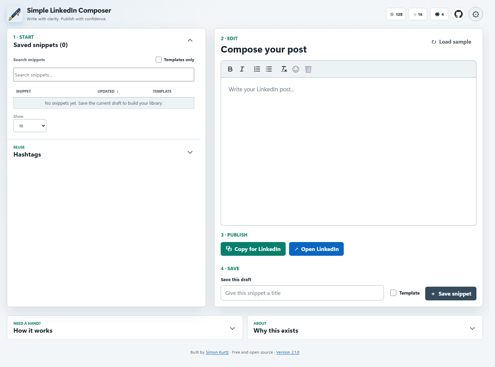

# Simple LinkedIn Composer

A local-first rich-text workspace for drafting LinkedIn posts, preserving supported formatting, and reusing snippets and hashtags.

Hosted at [https://linkedin-composer.simondoescloud.com](https://linkedin-composer.simondoescloud.com)

## Features

- Compose posts with bold, italic, ordered-list, bullet-list, link, and emoji support.
- Convert supported formatting into characters that survive pasting into LinkedIn.
- Save reusable drafts and templates in browser local storage.
- Search snippets and sort reusable hashtags by name or frequency.
- Export and import snippets as validated JSON.
- Use a responsive workspace tested at desktop and mobile Chromium viewports.
- Keep composer content local with no cloud synchronization.

## Usage

1. Enter the final segment of your LinkedIn profile URL in **LinkedIn profile ID**.
1. Compose a post or select **Load sample**.
1. Apply supported formatting with the editor toolbar.
1. Select **Copy post**.
1. Select **Open LinkedIn**, paste the converted post, review it, and publish from LinkedIn.

Do not copy directly from the editor when you need formatting conversion; use **Copy post**.

## Snippet management

| Action | How to use it                                       |
| ------ | --------------------------------------------------- |
| Save   | Enter a title, optionally select Template, and save |
| Load   | Select the snippet title in the library             |
| Delete | Select the snippet's delete action                 |
| Export | Download all saved snippets as JSON                |
| Import | Select a compatible JSON export                    |

Imports accept the existing exported JSON object format. Each key must be `snippet-` followed by a title of up to 50 characters. Each value may be the exported JSON string or its parsed object and must contain a Quill `delta`, a valid timestamp, and an optional Boolean template flag. Supported formatting is bold, italic, ordered or bullet lists, and HTTP(S) links. Unknown or malformed entries are skipped without deleting other valid local snippets.

## Hashtags

Hashtags in saved snippets are counted in the hashtag library. Sort them by name or frequency, then insert a hashtag at the editor cursor or open its LinkedIn context.

## Local data

Use **Clear data** to remove saved snippets, profile settings, and preferences from the current browser. Export snippets first when you want a backup.

## Privacy and analytics

The application code does not send your composer content to an application server. Its scripts, styles, editor libraries, and emoji data ship with the static site.

The hosted site uses Cloudflare Web Analytics for anonymous, aggregate usage and performance measurements. Hosting infrastructure also processes standard request metadata needed to deliver the site. These operational services do not receive post content, snippets, hashtags, profile settings, or local-storage values from the application.

**Post content, snippets, hashtags, and profile settings remain in browser local storage.** They are not included in analytics, and there is no cloud sync or advertising. External sites open only when you select a displayed link.

## Browser support

| Environment                  | Validation level                                  |
| ---------------------------- | ------------------------------------------------- |
| Chrome and Edge desktop      | Automated Chromium workflow and accessibility run |
| Chromium-based mobile        | Automated Pixel 7 responsive workflow             |
| Firefox and Safari           | Best effort; not in the automated browser matrix  |
| Forced colors/reduced motion | Automated Chromium coverage                       |

The tracked browser suite also verifies 200% text resizing, keyboard interaction, focus restoration, responsive overflow, console errors, and failed requests.

## Development

The application remains plain HTML, CSS, and JavaScript. Vite provides the local development server and creates the static production output.

Prerequisites:

- Node.js `26.7.0` from [.nvmrc](.nvmrc)
- pnpm `11.21.0` from the `packageManager` field in [package.json](package.json)

1. Install the Node.js version from `.nvmrc` and enable pnpm `11.21.0`.
1. Run `pnpm install --frozen-lockfile`.
1. Run `pnpm hooks:install` once per clone to configure the repository-managed Git hooks.
1. Run `pnpm dev` for local development.

| Command                    | Purpose                                              |
| -------------------------- | ---------------------------------------------------- |
| `pnpm check`               | Format check, lint, unit tests, and production build |
| `pnpm lockfile:check`      | Reject registry tarball metadata in the lockfile     |
| `pnpm lockfile:normalize`  | Remove registry tarball metadata after installs      |
| `pnpm test:browser`        | Chromium checks with local visual snapshots          |
| `pnpm test:browser:ci`     | CI browser checks without Windows snapshot matching  |
| `pnpm test:browser:update` | Review and refresh Windows visual baselines          |
| `pnpm build`               | Generate the static site in `dist/`                  |

The repository configures pnpm not to include tarball URLs. Because machine registry configuration can still add them, run `pnpm lockfile:normalize` after an install changes `pnpm-lock.yaml`. The repository check rejects remaining metadata, while the pre-commit hook cleans only the staged lockfile and leaves unstaged lockfile work unchanged.

Corporate or Microsoft proxy registry routing belongs in untracked user or machine pnpm configuration. Do not add proxy URLs, credentials, tokens, or private feed settings to repository files.

## Architecture and deployment

- `src/` contains the plain HTML, CSS, JavaScript, manifest, and static images.
- Vite bundles reviewed pnpm dependencies and writes deployable output to `dist/`.
- Composer state remains in browser local storage; there is no application backend.
- GitHub Actions installs from the frozen lockfile, runs repository and browser checks, and uploads only `dist/` to GitHub Pages.
- The Pages workflow intentionally runs on every push to `main`. It is the repository's only full CI and deployment gate, so path filters are not used.
- The custom domain serves the generated GitHub Pages artifact at the hosted URL above.

## Contributing

Please see [CONTRIBUTING.md](CONTRIBUTING.md) for details.

## Releases

See [CHANGELOG.md](CHANGELOG.md) for release notes. The application and package metadata currently identify version `1.7.0`.

## License

Licensed under the [MIT License](LICENSE).

Thanks to [Carolina-GomezM](https://github.com/Carolina-GomezM) and everyone who has contributed feedback or code.
